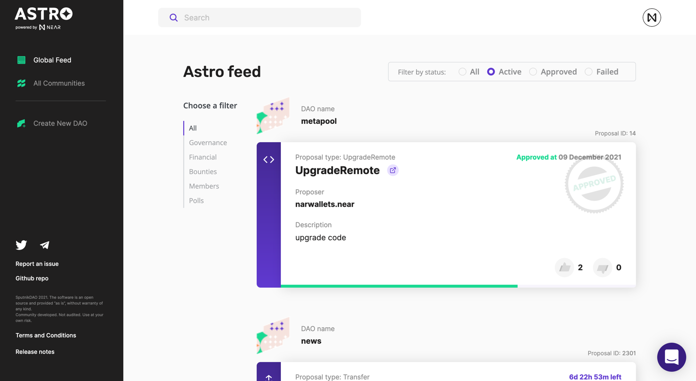

# Astro DAO

[](https://github.com/near-daos/astro-ui/releases/)
[](https://github.com/near-daos/astro-ui/actions/workflows/build-deploy.yaml)
[](https://t.me/astro_near)

Astro is a platform for launching Decentralized Autonomous Organizations. DAOs are self-organized groups that form around common purposes. Membership, decision making, and funding are coordinated in public on a tamper-proof blockchain.

#### Technology stack

- Blockchain: **[NEAR](https://near.org/)**
- Smart Contracts: **[Sputnik DAO Factory V2](https://github.com/near-daos/sputnik-dao-contract/tree/main/sputnikdao-factory2), [Sputnik DAO V2](https://github.com/near-daos/sputnik-dao-contract/tree/main/sputnikdao2)**
- Astro backend: **[Astro API gateway](https://github.com/near-daos/astro-api-gateway)**
- Astro landing page: **[Astro landing page](https://github.com/near-daos/astro-ui-landing)**
- Package manager: **[Yarn](https://yarnpkg.com/)**
- Core programming language: **[TypeScript](https://www.typescriptlang.org/)**
- Application framework: **[NextJS](https://nextjs.org/)**
- Code quality: **[Eslint](https://eslint.org/), [Prettier](https://prettier.io/)**
- Build: **[Docker](https://www.docker.com/)**

#### Status

[Change Log](https://github.com/near-daos/astro-ui/releases/latest)

#### Links

- Dev: **[dev.app.astrodao.com](https://dev.app.astrodao.com/all/daos)**
- Test: **[testnet.app.astrodao.com](https://testnet.app.astrodao.com/all/daos)**
- Staging: **[staging.app.astrodao.com](https://staging.app.astrodao.com/all/daos)**
- Production: **[app.astrodao.com](https://app.astrodao.com/all/daos)**



## Getting Started

###### Clone the repo

```
git clone git@github.com:near-daos/astro-ui.git
```

###### Install dependencies

```bash
yarn install
```

###### Run development server

```bash
yarn dev
```

Open [http://localhost:8080](http://localhost:8080) with your browser to see the result.

##### Known issues

The application can fail loading icons when running locally, in this case just build an application locally before starting development server using this command:

```
yarn build
```

#### Getting involved

All change requests commits should follow the [Conventional Commits](https://www.conventionalcommits.org/en/v1.0.0/) specification.
Proposed changes should be small and isolated.

#### Release planning schedule

We are trying to stick to two weeks schedule, the list of issues that are planning for next release can be checked in [Milestones](https://github.com/near-daos/astro-ui/milestones) section
